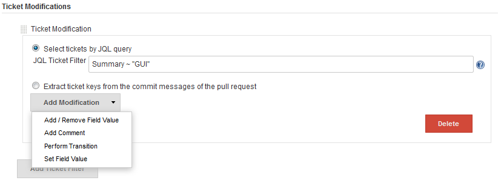
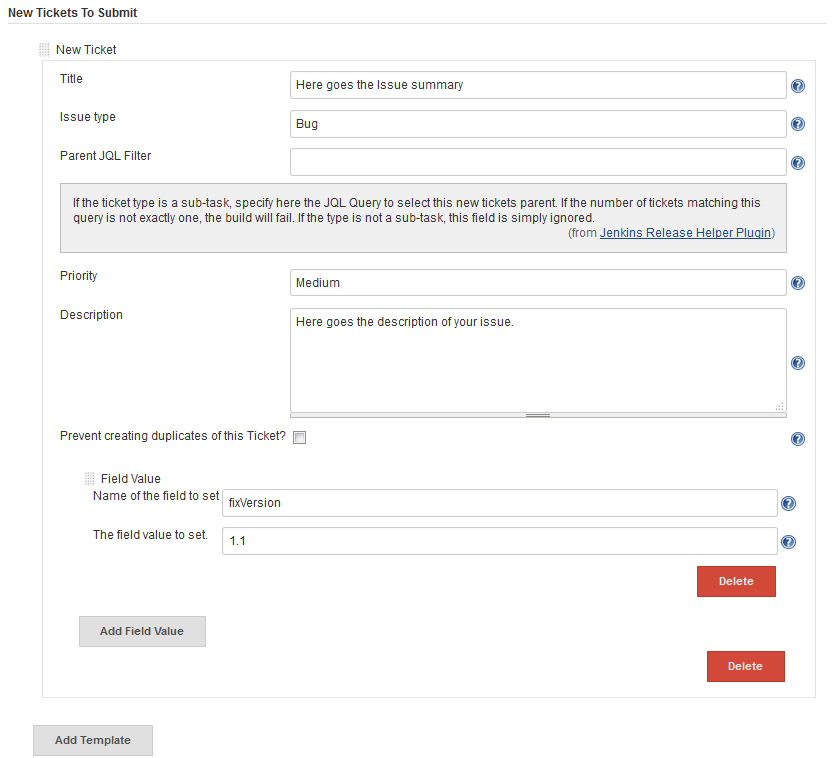
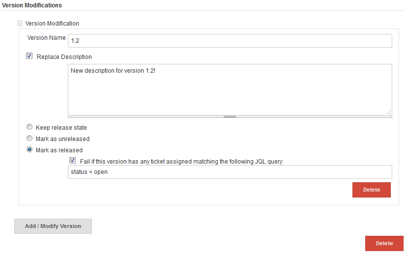
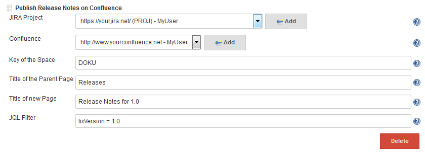
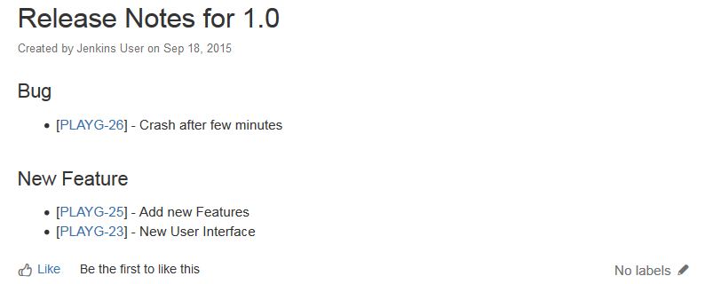

Jenkins Release Plugin
===================== 

What is it?
--------------------------

This plugin aims to automate several tasks of the release process of InspectIT.
It offers the following features:

* update / create JIRA Tickets
* update / create JIRA Releases
* publish release notes and artifacts on GitHub
* publish release notes on Confluence
* publish status updates on Twitter
* publish measurement points in an InfluxDB
	
How to use it
--------------
This project uses Apache Maven.
Execute 

	mvn clean install hpi:hpi -DskipTests=true
	
to create the .hpi file.
This file can then be installed to your Jenkins Instance using the Jenkins settings / advanced menu.

Jenkins Configuration
---------------------
### Variables
Build Parameters as well as Environment Variables can be accessed from every field using the *${variablename}* syntax.
The plugin will then replace this placeholder with the actual contents of the parameter or variable named *variablename*.

### Credentials
The plugin adds two new credential types to your Jenkins: one for access a certain JIRA Project, and another one for accessing Confluence.
These credentials can be entered using the Jenkins credentials settings, a screenshot of the JIRA credentials dialog is given below.
Note that these dialogs do automatically check whether JIRA / Confluence is accessible using the data you entered.

### Adding and Modifying JIRA Tickets

To add or Modify Tickets, add the **JIRA Ticket Editor** Build-Step to your project.
There are two ways to select the Tickets to be modified:

1. Enter a JIRA-Query-Language (JQL) statement selecting your tickets
2. If the Build was triggered by the GitHub Pull Request Builder Plugin, you can give a regular expression to extract the Ticket-Keys from the commit messages of the pull request.

Afterwards, you can select the modifications to apply to the tickets matching these criteria.

In a similar way, new JIRA Tickets can be published:

### Adding and Modifying JIRA Releases

Select the **Add / Modify JIRA Project Versions** build-step. Using this buildstep, you can modify or add multiple project versions.
If the given version name already exists, it is updated, otherwise a new version for the project is created.

### Publishing Release Notes on Confluence

The bundle also offers a build step called **Publish Release Notes on Confluence** which creates a confluence page.
This confluence page contains a list of tickets, selected using a JQL Query provided by the user.
Below you can see an example configuration, including the page which it creates.

### Publishing Releases on GitHub

This feature is available as the **Publish A Release on GitHub** post-build action.
Using this action, you can create a release on GitHub and upload build artifacts to it.
The release description works in the same manner as for the confluence release notes page.

### Twitter Publisher

This build step offers you the possibility to publish a Twitter status update.
The build step checks whether a recent tweet with the same text already exists in order to prevent duplicate tweets.

### InfluxDB Publisher

The **InfluxDB Publisher** build step allows you to add measurement points to an InfluxDB instance.
The measurement points are given to the plugin in the format specified [here](https://docs.influxdata.com/influxdb/v0.9/write_protocols/line/).

